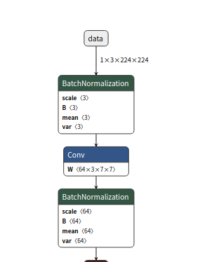
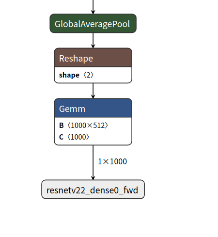
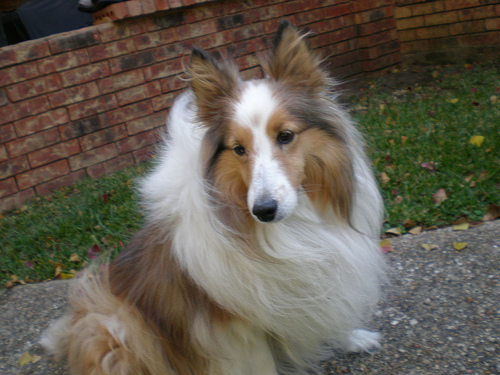

R329是矽速科技开发的强大的AI功能,今天尝试下在上面部署分类网络resnet18.
模型量化的代码及数据我都放在了[github](https://github.com/lyyiangang/r329)
# 模型下载
onnx模型是有个一个model zoo的,其中resnet18的下载地址为:[链接](https://github.com/onnx/models/tree/master/vision/classification/resnet/model)

# 网络结构

由于网络比较大,一张图不好显示,这里只列出模型的输入和输出节点.
输入:



输出:



# 生成calibration数据

r329上面NN推理使用的是周易AIPU, 它需要将模型进行量化,熟悉量化的朋友应该知道量化可以简单分为post quant和QAT, 而周易AIPU使用的则是post quant,
需要我们提供calibration data. 
```bash
python gen_calib_dataset.py
```
该脚本会读取```dataset/img/```目录下的图片,将其做归一化,归一化的数据会保存在```dataset/dataset.npy```, label保存为```dataset/label.npy```.
代码内容:
```python
import numpy as np
import sys
import os
import cv2

img_dir='./dataset/img/'
label_file='./dataset/label.txt'

input_height=224
input_width=224
mean = np.array([0.485, 0.456, 0.406], np.float32)
var = np.array([0.229, 0.224, 0.225], np.float32)

imgs = []
labels = []
with open(label_file, 'r') as fid:
    for line in fid:
        filename, label = line.rstrip('\n').split(' ')
        labels.append(int(label))
        img = cv2.imread(os.path.join(img_dir, filename)) 
        img = cv2.cvtColor(img, cv2.COLOR_BGR2RGB)
        # ToTensor and Normalize
        img = cv2.resize(img, (input_width, input_height)).astype(np.float32) / 255
        norm_img = (img - mean) / var
        imgs.append(norm_img)

imgs = np.asarray(imgs)
labels = np.asarray(labels)
out_label = 'dataset/label.npy'
out_dataset = 'dataset/dataset.npy'
print(f'writing {out_label} and {out_dataset}')
np.save(out_label, labels)
np.save(out_dataset, imgs)
```
注意：这里的mean和var对应训练resnet使用的归一化操作：
```python
transform.ToTensor()
transform.Normalize(mean, va)
```
对应的python实现，所以我们需要保证训练和测试时使用同样的归一化操作．

# 生成推理验证数据

一般来说8bit量化后的模型相对原始的32bit模型精度会有所下降，这里我们生成数据验证下精度降低多少．
```bash
python gen_input.py
```
该代码会读取一张图片，并将其转换为```dataset/input.bin```

# 编辑配置文件

配置文件如下：
```
[Common]
mode = run

[Parser]
model_type = onnx
input_data_format = NCHW
model_name = densnet
detection_postprocess = 
model_domain = image_classification
input_model = ./model/resnet18-v2-7.onnx
input = data
input_shape = [1, 3, 224, 224]
output =resnetv22_dense0_fwd

[AutoQuantizationTool]
quantize_method = SYMMETRIC
ops_per_channel = DepthwiseConv
reverse_rgb = False
calibration_data = ./dataset/dataset.npy
calibration_label = ./dataset/label.npy
label_id_offset = 0
preprocess_mode = normalize
quant_precision = int8

[GBuilder]
inputs=dataset/input.bin
simulator=aipu_simulator_z1
outputs=dataset/output.bin
profile= True
target=Z1_0701
```
关于这个文件要注意下面几个问题．
1. onnx模型是nchw格式，所以**input_data_format**项要做对应修改．
2. input_mode为onnx模型名称，　**input**和**output**为net的输入输出节点名字
3. **calibration_data**和**calibration_label**要填写为我们上面生成的calibration数据
4. **inputs**和**outputs**为验证推理输入和quant模型预测的结果
配置完成后开始量化和验证模型

```bash
aipubuild resnet_onnx_run.cfg
```

log结果如下：

```
[I] Parsing model....
[I] [Parser]: Begin to parse onnx model densnet...
[I] [Parser]: Parser done!
[I] Parse model complete
[I] Quantizing model....
[I] AQT start: model_name:densnet, calibration_method:MEAN, batch_size:1
[I] ==== read ir ================
[I] 	float32 ir txt: /tmp/AIPUBuilder_1626945574.3679392/densnet.txt
[I] 	float32 ir bin2: /tmp/AIPUBuilder_1626945574.3679392/densnet.bin
[I] ==== read ir DONE.===========
[I] ==== auto-quantization ======
[I] 	step1: get max/min statistic value DONE
[I] 	step2: quantization each op DONE
[I] 	step3: build quantization forward DONE
[I] 	step4: show output scale of end node:
[I] 		layer_id: 50, layer_top:resnetv22_dense0_fwd, output_scale:[8.488549]
[I] ==== auto-quantization DONE =
[I] Quantize model complete
[I] Building ...
[I] [common_options.h: 276] BuildTool version: 4.0.175. Build for target Z1_0701 at frequency 800MHz
[I] [common_options.h: 297] using default profile events to profile AIFF

[I] [IRChecker] Start to check IR: /tmp/AIPUBuilder_1626945574.3679392/densnet_int8.txt
[I] [IRChecker] model_name: densnet
[I] [IRChecker] IRChecker: All IR pass
[I] [graph.cpp : 846] loading graph weight: /tmp/AIPUBuilder_1626945574.3679392/densnet_int8.bin size: 0xb2c024
[I] [builder.cpp:1059] Total memory for this graph: 0x1191d00 Bytes
[I] [builder.cpp:1060] Text   section:	0x00027c80 Bytes
[I] [builder.cpp:1061] RO     section:	0x00002b00 Bytes
[I] [builder.cpp:1062] Desc   section:	0x00004e00 Bytes
[I] [builder.cpp:1063] Data   section:	0x00b2c780 Bytes
[I] [builder.cpp:1064] BSS    section:	0x005f5c00 Bytes
[I] [builder.cpp:1065] Stack         :	0x00040400 Bytes
[I] [builder.cpp:1066] Workspace(BSS):	0x000c4000 Bytes
[I] [main.cpp  : 467] # autogenrated by aipurun, do NOT modify!
LOG_FILE=log_default
FAST_FWD_INST=0
INPUT_INST_CNT=1
INPUT_DATA_CNT=2
CONFIG=Z1-0701
LOG_LEVEL=0
INPUT_INST_FILE0=/tmp/temp_554fb74a3eef87b85c7b2c95f2a37.text
INPUT_INST_BASE0=0x0
INPUT_INST_STARTPC0=0x0
INPUT_DATA_FILE0=/tmp/temp_554fb74a3eef87b85c7b2c95f2a37.ro
INPUT_DATA_BASE0=0x10000000
INPUT_DATA_FILE1=/tmp/temp_554fb74a3eef87b85c7b2c95f2a37.data
INPUT_DATA_BASE1=0x20000000
OUTPUT_DATA_CNT=2
OUTPUT_DATA_FILE0=dataset/output.bin
OUTPUT_DATA_BASE0=0x21300200
OUTPUT_DATA_SIZE0=0x3e8
OUTPUT_DATA_FILE1=profile_data.bin
OUTPUT_DATA_BASE1=0x20d30b80
OUTPUT_DATA_SIZE1=0x600
RUN_DESCRIPTOR=BIN[0]

[I] [main.cpp  : 118] run simulator:
aipu_simulator_z1 /tmp/temp_554fb74a3eef87b85c7b2c95f2a37.cfg
[INFO]:SIMULATOR START!
[INFO]:========================================================================
[INFO]:                             STATIC CHECK
[INFO]:========================================================================
[INFO]:  INST START ADDR : 0x0(0)
[INFO]:  INST END ADDR   : 0x27c7f(162943)
[INFO]:  INST SIZE       : 0x27c80(162944)
[INFO]:  PACKET CNT      : 0x27c8(10184)
[INFO]:  INST CNT        : 0x9f20(40736)
[INFO]:------------------------------------------------------------------------
[WARN]:[0803] INST WR/RD REG CONFLICT! PACKET 0x238: 0x472021b(POP R27,Rc7) vs 0x5f00000(MVI R0,0x0,Rc7), PACKET:0x238(568) SLOT:0 vs 3
[WARN]:[0803] INST WR/RD REG CONFLICT! PACKET 0x245: 0x472021b(POP R27,Rc7) vs 0x5f00000(MVI R0,0x0,Rc7), PACKET:0x245(581) SLOT:0 vs 3
[WARN]:[0803] INST WR/RD REG CONFLICT! PACKET 0x3aa: 0x472021b(POP R27,Rc7) vs 0x9f80020(ADD.S R0,R0,0x1,Rc7), PACKET:0x3aa(938) SLOT:0 vs 3
[WARN]:[0803] INST WR/RD REG CONFLICT! PACKET 0x5e7: 0x4520180(BRL R0) vs 0x47a03e4(ADD R4,R0,R31,Rc7), PACKET:0x5e7(1511) SLOT:0 vs 3
[WARN]:[0803] INST WR/RD REG CONFLICT! PACKET 0x780: 0x4720204(POP R4,Rc7) vs 0x9f80020(ADD.S R0,R0,0x1,Rc7), PACKET:0x780(1920) SLOT:0 vs 3
[WARN]:[0803] INST WR/RD REG CONFLICT! PACKET 0xc2a: 0x4720204(POP R4,Rc7) vs 0x47a1be0(ADD R0,R6,R31,Rc7), PACKET:0xc2a(3114) SLOT:0 vs 3
[WARN]:[0803] INST WR/RD REG CONFLICT! PACKET 0x1050: 0x472021b(POP R27,Rc7) vs 0x5f00000(MVI R0,0x0,Rc7), PACKET:0x1050(4176) SLOT:0 vs 3
[WARN]:[0803] INST WR/RD REG CONFLICT! PACKET 0x105d: 0x472021b(POP R27,Rc7) vs 0x5f00000(MVI R0,0x0,Rc7), PACKET:0x105d(4189) SLOT:0 vs 3
[WARN]:[0803] INST WR/RD REG CONFLICT! PACKET 0x11c2: 0x472021b(POP R27,Rc7) vs 0x9f80020(ADD.S R0,R0,0x1,Rc7), PACKET:0x11c2(4546) SLOT:0 vs 3
[WARN]:[0803] INST WR/RD REG CONFLICT! PACKET 0x135f: 0x4520180(BRL R0) vs 0x47a03e5(ADD R5,R0,R31,Rc7), PACKET:0x135f(4959) SLOT:0 vs 3
[INFO]:========================================================================
[INFO]:                             STATIC CHECK END
[INFO]:========================================================================

[INFO]:AIPU START RUNNING: BIN[0]
[INFO]:TOTAL TIME: 3.267529s. 
[INFO]:SIMULATOR EXIT!
[I] [main.cpp  : 135] Simulator finished.
```

# 比较结果

运行下列命令查看quant模型的预测结果
```bash
python compare_result.py
```

程序会读取input.bin并做预测．
打印结果：

```bash
class is Shetland sheepdog, Shetland sheep dog, Shetland prob:127
```

模型预测为狗，
而input.bin对应者下面这张图：



模型的确预测对了．．

以上所有代码及数据：[github](https://github.com/lyyiangang/r329)